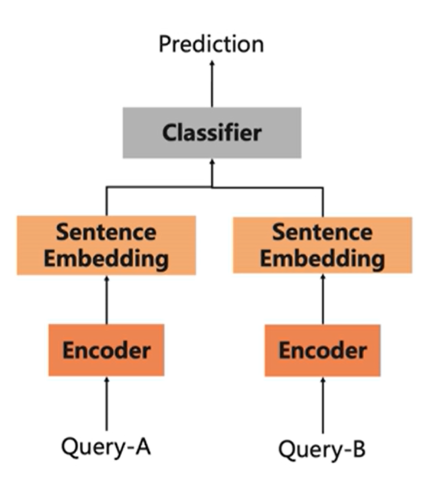
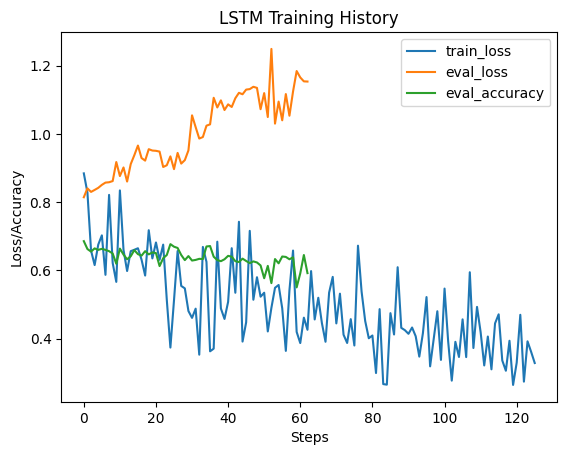
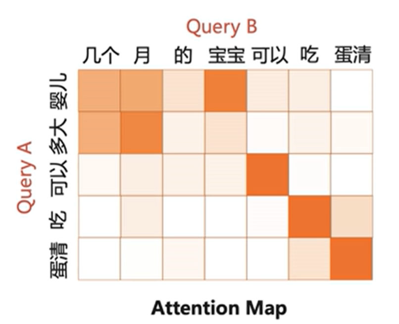
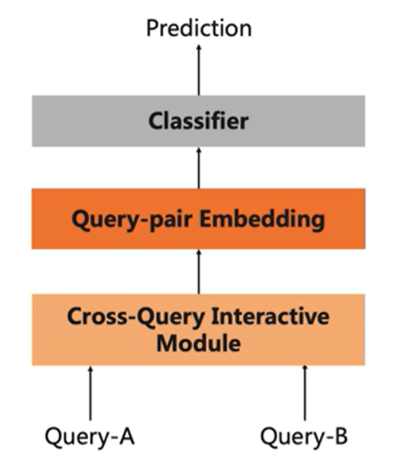
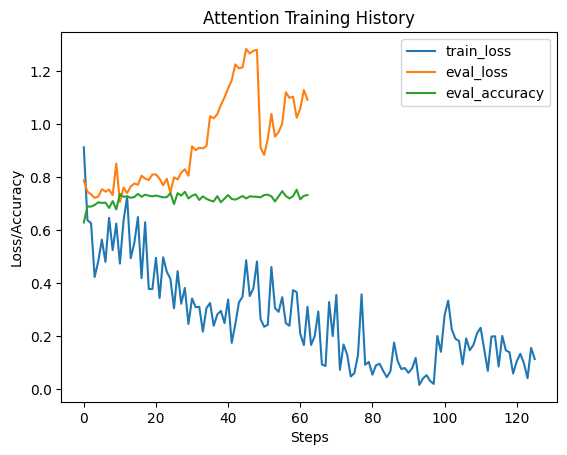

# 大作业：医学搜索Query相关性判断

> 队员：杨永康，王润泽，高乔

## 1. Background

Query（即搜索词）之间的相关性是评估两个Query所表述主题的匹配程度，即判断Query-A和Query-B是否发生转义，以及转义的程度。Query的主题是指query的专注点，判定两个查询词之间的相关性是一项重要的任务，常用于长尾query的搜索质量优化场景，本任务数据集就是在这样的背景下产生的。数据集来源于中文医疗信息评测基准[CBLUE](https://tianchi.aliyun.com/cblue) ，由阿里巴巴夸克医疗事业部提供。

Query和Title的相关度共分为3档（0-2），0分为相关性最差，2分表示相关性最好。

- 2分：表示A与B等价，表述完全一致
- 1分： B为A的语义子集，B指代范围小于A
- 0分：B为A的语义父集，B指代范围大于A； 或者A与B语义毫无关联

本评测开放训练集数据15000条，验证集数据1600条，测试集数据1596条。
下载文件名为KUAKE-QQR.zip, 包括：

- `KUAKE-QQR_train.json`: 训练集
- `KUAKE-QQR_dev.json`: 验证集
- `KUAKE-QQR_test.json`: 测试集，选手提交的时候需要为每条记录增加“label”字段
- `example_pred.json`: 提交结果示例

数据格式如下：

```json
# 训练集（KUAKE-QQR_train.json）/验证集（KUAKE-QQR_dev.json）的格式为：
[
  {
    "id": "s1",               # 记录id 
    "query1": "天价输液费",     # Query-1
    "query2": "输液价格",      # Query-2
    "label": "0"              # 相关性得分
  },
  ...
]
# 测试集（KUAKE-QQR_test.json）的格式为：
[
  {
    "id": "s31",               # 记录id
    "query1": "患腱鞘炎",       # query-1
    "query2": "腱鞘炎怎么得的",  # query-2
    "label": ""                # 需预测标签，默认都是空字符串
  },
  ...
]
```

## 2. Baseline

### 2.0 Tokenization

对于中文文本，在将文本 (Text) 输入进网络之前，需要转化成对应的 **Embedding**，这通常可以利用：

- 使用现有训练好的“字典文本集” 查表得到，比如：`tencent-ailab-embedding-zh-d100-v0.2.0-s.txt`；

- 利用 **Hugging Face** 提供的 `Transfromer` 库中 `tokenizer` 获取。

### 2.1 LSTM

经典的循环神经网络(RNN) LSTM能够处理序列文本，由于我们需要编码 Sentence Embedding，所以选择**双向LSTM**。对于Sentence Similarity 的问题，其网络由以下两个模块组成：

#### Encoder

`Encoder` 是将LSTM的隐藏状态进行 “求平均” (**Mean Pooling**) 的方式，对所有句子文本，提取出 Sentence Embedding。
$$
SE = \text{Mean}_i\{\text{LSTM}(x_i,h_{i-1},c_{i-1},h'_{i+1},c'_{i+1})\}
$$
其中 $x_i$ 是当前输入 Token embedding, $h_{i-1},c_{i-1}$ 是正序的隐向量和记忆元， $h'_{i+1},c'_{i+1}$ 是逆序的隐向量和记忆元。

```python
class Encoder(nn.Module):
    def __init__(self, in_feat: int = 100, dropout_prob: float = 0.1):
        super().__init__()
        self.lstm = nn.LSTM(input_size=in_feat, 
                            hidden_size=in_feat, 
                            bidirectional=True, 
                            batch_first=True)
    def forward(self, token_embeds, attention_mask):
        batch_size = attention_mask.size(0)
        output, (h, c) = self.lstm(token_embeds)
        output, lens_output = pad_packed_sequence(output, batch_first=True)
        # 双向LSTM出来的hidden states做平均
        output = torch.stack([output[i][:lens_output[i]].mean(dim=0) 
                              for i in range(batch_size)], dim=0)
        return output
```

#### Classifier

`Classifier` 模块用于对融合后的句子表示进行分类，输出相似度标签，是简单的MLP层，用于分类

```python
class Classifier(nn.Module):
    def __init__(self, in_feat, num_labels: int, dropout_prob: float = 0.1):
        super().__init__()
        self.dense1 = nn.Linear(in_feat, in_feat // 2)
        self.dense2 = nn.Linear(in_feat // 2, num_labels)
        self.act = nn.Tanh()
        self.dropout = nn.Dropout(dropout_prob)
    def forward(self, x):
        x = self.act(self.dense1(self.dropout(x)))
        x = self.dense2(self.dropout(x))
        return x
```

#### Pipeline



### result



训练不够稳定，在测试集上分数为：**0.6999**

### 2.2 Attention

与 **LSTM** 直接将两个句子的 Embedding 拼接后输入给网络不同，**Attention** 方法利用 Cross-Attention 机制，增强两个 SE 的语义信息。

#### Cross Attention

具体来说，对于句子A和句子B，计算它们之间的注意力得分矩阵 `cross_attn`，即通过矩阵乘法 得到 `cross_attn` 矩阵，表示句子间中字词之间的关联性:

$$
Attention = SE_A \times SE_B^T
$$


之后对输入的 `SE_A`,`SE_B` 句子进行增强。
$$
Atten_A,Atten_B = attention(SE_A,SE_B)
\\argument(SE_A) = SE_A\oplus Atten_A \oplus (SE_A-Atten_A)\oplus (SE_A\times Atten_A)
$$

```python
class CrossAttention(nn.Module):
    def __init__(self, in_feat, dropout):
        super().__init__()

        self.dense = nn.Linear(4*in_feat, in_feat//2)
        self.act = nn.ReLU()
        self.dropout = nn.Dropout(dropout)

    def forward(self, a, b, mask_a, mask_b):
        in_feat = a.size(-1)

        # a: [B, L1, H], b: [B, L2, H]
        # 计算query A和query B之间的attention score，即 Key * Value
        cross_attn = torch.matmul(a, b.transpose(1, 2))   # [B, L1, L2]

        # 将填充位置的score设为-1e9，即不考虑填充位置的信息
        row_attn = cross_attn.masked_fill((mask_b == False).unsqueeze(1), -1e9)
        row_attn = row_attn.softmax(dim=2)    # [B, L1, L2]

        col_attn = cross_attn.permute(0, 2, 1).contiguous()   # [B, L2, L1]
        col_attn = col_attn.masked_fill((mask_a == False).unsqueeze(1), -1e9)
        col_attn = col_attn.softmax(dim=2)

        # attention score * value
        attn_a = torch.matmul(row_attn, b)      # [B, L1, H]
        attn_b = torch.matmul(col_attn, a)      # [B, L2, H]
        
        diff_a = a - attn_a
        diff_b = b - attn_b
        prod_a = a * attn_a
        prod_b = b * attn_b

        # 将原本的hidden state和attention得到的hidden state拼接，并经过线性变换降维
        a = torch.cat([a, attn_a, diff_a, prod_a], dim=-1)    # [B, L1, 4*H]
        b = torch.cat([b, attn_b, diff_b, prod_b], dim=-1)    # [B, L2, 4*H]

        a = self.act(self.dense(self.dropout(a)))                # [B, L1, H/2]
        b = self.act(self.dense(self.dropout(b)))                # [B, L2, H/2]

        return a, b
```

#### Pipeline

流程和LSTM类似，只是多了一步数据增强



#### Result



结果依然不够稳定，在测试集上的分数为：**0.7707**
