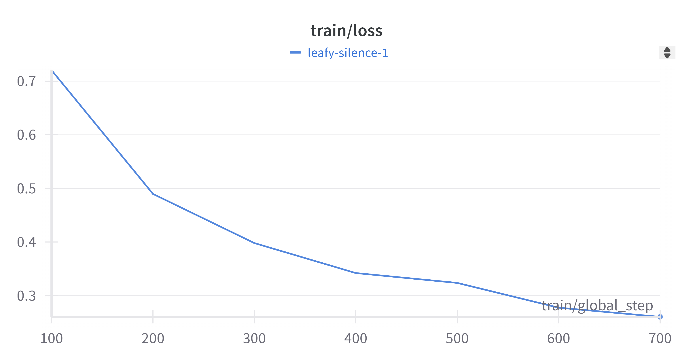
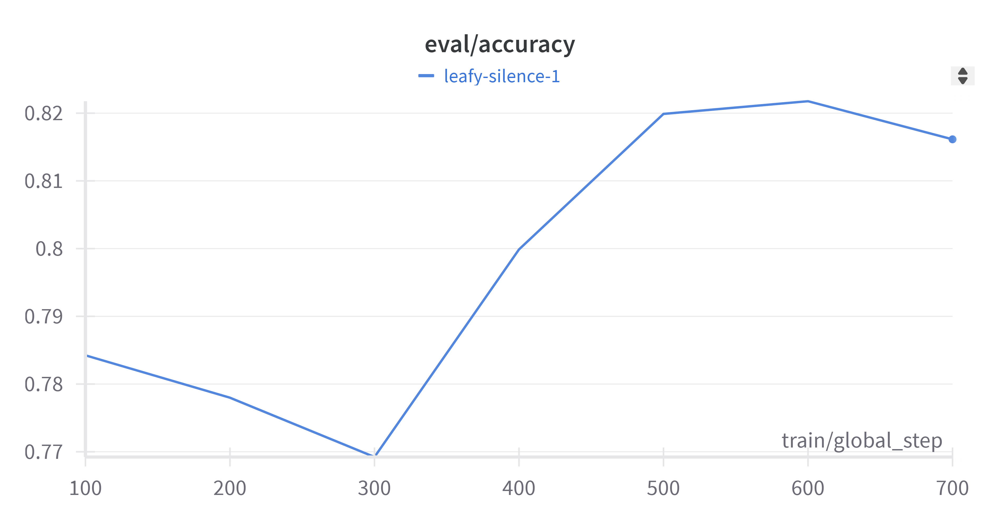
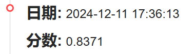
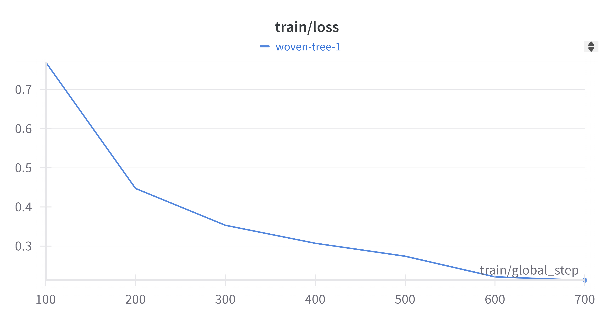
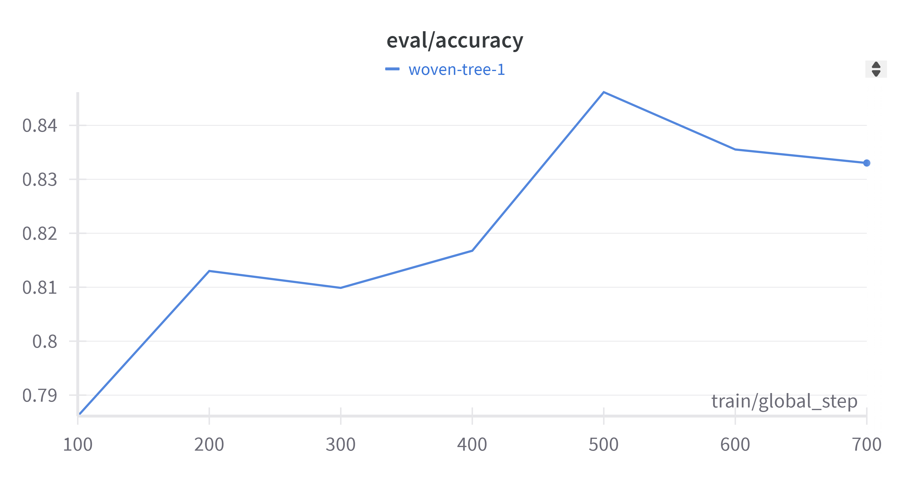
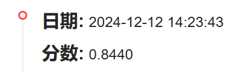
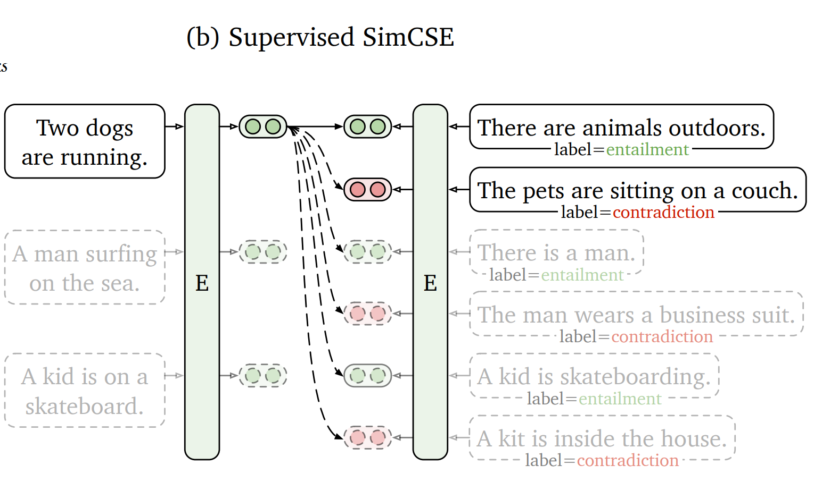

# 大作业：医学搜索Query相关性判断

> 队员：杨永康，王润泽，高乔

## 1. Background

Query（即搜索词）之间的相关性是评估两个Query所表述主题的匹配程度，即判断Query-A和Query-B是否发生转义，以及转义的程度。Query的主题是指query的专注点，判定两个查询词之间的相关性是一项重要的任务，常用于长尾query的搜索质量优化场景，本任务数据集就是在这样的背景下产生的。数据集来源于中文医疗信息评测基准[CBLUE](https://tianchi.aliyun.com/cblue) ，由阿里巴巴夸克医疗事业部提供。

Query和Title的相关度共分为3档（0-2），0分为相关性最差，2分表示相关性最好。

- 2分：表示A与B等价，表述完全一致
- 1分： B为A的语义子集，B指代范围小于A
- 0分：B为A的语义父集，B指代范围大于A； 或者A与B语义毫无关联

本评测开放训练集数据15000条，验证集数据1600条，测试集数据1596条。
下载文件名为KUAKE-QQR.zip, 包括：

- `KUAKE-QQR_train.json`: 训练集
- `KUAKE-QQR_dev.json`: 验证集
- `KUAKE-QQR_test.json`: 测试集，选手提交的时候需要为每条记录增加“label”字段
- `example_pred.json`: 提交结果示例

数据格式如下：

```json
# 训练集（KUAKE-QQR_train.json）/验证集（KUAKE-QQR_dev.json）的格式为：
[
  {
    "id": "s1",               # 记录id 
    "query1": "天价输液费",     # Query-1
    "query2": "输液价格",      # Query-2
    "label": "0"              # 相关性得分
  },
  ...
]
# 测试集（KUAKE-QQR_test.json）的格式为：
[
  {
    "id": "s31",               # 记录id
    "query1": "患腱鞘炎",       # query-1
    "query2": "腱鞘炎怎么得的",  # query-2
    "label": ""                # 需预测标签，默认都是空字符串
  },
  ...
]
```

## 2. Baseline

### 2.0 Tokenization

对于中文文本，在将文本 (Text) 输入进网络之前，需要转化成对应的 **Embedding**，这通常可以利用：

- 使用现有训练好的“字典文本集” 查表得到，比如：`tencent-ailab-embedding-zh-d100-v0.2.0-s.txt`；

- 利用 **Hugging Face** 提供的 `Transfromer` 库中 `tokenizer` 获取。

### 2.1 LSTM

经典的循环神经网络(RNN) LSTM能够处理序列文本，由于我们需要编码 Sentence Embedding，所以选择**双向LSTM**。对于Sentence Similarity 的问题，其网络由以下两个模块组成：

#### Encoder

`Encoder` 是将LSTM的隐藏状态进行 “求平均” (**Mean Pooling**) 的方式，对所有句子文本，提取出 Sentence Embedding。
$$
SE = \text{Mean}_i\{\text{LSTM}(x_i,h_{i-1},c_{i-1},h'_{i+1},c'_{i+1})\}
$$
其中 $x_i$ 是当前输入 Token embedding, $h_{i-1},c_{i-1}$ 是正序的隐向量和记忆元， $h'_{i+1},c'_{i+1}$ 是逆序的隐向量和记忆元。

```python
class Encoder(nn.Module):
    def __init__(self, in_feat: int = 100, dropout_prob: float = 0.1):
        super().__init__()
        self.lstm = nn.LSTM(input_size=in_feat, 
                            hidden_size=in_feat, 
                            bidirectional=True, 
                            batch_first=True)
    def forward(self, token_embeds, attention_mask):
        batch_size = attention_mask.size(0)
        output, (h, c) = self.lstm(token_embeds)
        output, lens_output = pad_packed_sequence(output, batch_first=True)
        # 双向LSTM出来的hidden states做平均
        output = torch.stack([output[i][:lens_output[i]].mean(dim=0) 
                              for i in range(batch_size)], dim=0)
        return output
```

#### Classifier

`Classifier` 模块用于对融合后的句子表示进行分类，输出相似度标签，是简单的MLP层，用于分类

```python
class Classifier(nn.Module):
    def __init__(self, in_feat, num_labels: int, dropout_prob: float = 0.1):
        super().__init__()
        self.dense1 = nn.Linear(in_feat, in_feat // 2)
        self.dense2 = nn.Linear(in_feat // 2, num_labels)
        self.act = nn.Tanh()
        self.dropout = nn.Dropout(dropout_prob)
    def forward(self, x):
        x = self.act(self.dense1(self.dropout(x)))
        x = self.dense2(self.dropout(x))
        return x
```

#### Pipeline


### result


训练不够稳定，在测试集上分数为：**0.6999**

### 2.2 Attention

与 **LSTM** 直接将两个句子的 Embedding 拼接后输入给网络不同，**Attention** 方法利用 Cross-Attention 机制，增强两个 SE 的语义信息。

#### Cross Attention

具体来说，对于句子A和句子B，计算它们之间的注意力得分矩阵 `cross_attn`，即通过矩阵乘法 得到 `cross_attn` 矩阵，表示句子间中字词之间的关联性:

$$
Attention = SE_A \times SE_B^T
$$


之后对输入的 `SE_A`,`SE_B` 句子进行增强。
$$
Atten_A,Atten_B = attention(SE_A,SE_B)
\\argument(SE_A) = SE_A\oplus Atten_A \oplus (SE_A-Atten_A)\oplus (SE_A\times Atten_A)
$$

```python
class CrossAttention(nn.Module):
    def __init__(self, in_feat, dropout):
        super().__init__()

        self.dense = nn.Linear(4*in_feat, in_feat//2)
        self.act = nn.ReLU()
        self.dropout = nn.Dropout(dropout)

    def forward(self, a, b, mask_a, mask_b):
        in_feat = a.size(-1)

        # a: [B, L1, H], b: [B, L2, H]
        # 计算query A和query B之间的attention score，即 Key * Value
        cross_attn = torch.matmul(a, b.transpose(1, 2))   # [B, L1, L2]

        # 将填充位置的score设为-1e9，即不考虑填充位置的信息
        row_attn = cross_attn.masked_fill((mask_b == False).unsqueeze(1), -1e9)
        row_attn = row_attn.softmax(dim=2)    # [B, L1, L2]

        col_attn = cross_attn.permute(0, 2, 1).contiguous()   # [B, L2, L1]
        col_attn = col_attn.masked_fill((mask_a == False).unsqueeze(1), -1e9)
        col_attn = col_attn.softmax(dim=2)

        # attention score * value
        attn_a = torch.matmul(row_attn, b)      # [B, L1, H]
        attn_b = torch.matmul(col_attn, a)      # [B, L2, H]
        
        diff_a = a - attn_a
        diff_b = b - attn_b
        prod_a = a * attn_a
        prod_b = b * attn_b

        # 将原本的hidden state和attention得到的hidden state拼接，并经过线性变换降维
        a = torch.cat([a, attn_a, diff_a, prod_a], dim=-1)    # [B, L1, 4*H]
        b = torch.cat([b, attn_b, diff_b, prod_b], dim=-1)    # [B, L2, 4*H]

        a = self.act(self.dense(self.dropout(a)))                # [B, L1, H/2]
        b = self.act(self.dense(self.dropout(b)))                # [B, L2, H/2]

        return a, b
```

#### Pipeline

流程和LSTM类似，只是多了一步数据增强


#### Result


结果依然不够稳定，在测试集上的分数为：**0.7707**

## 2.3 Bert

BERT (Bidirectional Encoder Representations from Transformers) 是一种双向的预训练语言模型，具有以下特点：

- **Transformer架构**：基于多头自注意力机制的Transformer架构。
- **双向特性**：通过结合左右上下文，捕获更全面的语言表示。
- **输入格式**：
  - 输入文本经过分词后，加入特殊标记 `[CLS]` 和 `[SEP]`，形成模型的输入格式。
  - `[CLS]` 是整体句子向量表示，用于分类任务。
  - `[SEP]` 用于分隔句对任务的两个输入。

BERT的预训练目标包括：

- **掩码语言模型（Masked Language Model, MLM）**：随机掩盖部分输入词，预测被掩盖词。
- **下一句预测（Next Sentence Prediction, NSP）**：预测两个句子是否是连续的。

通过上述目标，BERT能够学习上下文相关的深层语义表示，在下游任务中表现优异.

#### Data Preprocess

1. **过滤与转换**：

   - 将句子对映射到 `text_a` 和 `text_b`，并将 `label` 转换为整数。

2. **转换数据为BERT输入**：

   - 对于句对任务，输入需要包括两个句子 `query1` 和 `query2`。

   - 使用分词器将两句拼接，中间用 `[SEP]` 分隔，并在序列开头加入 `[CLS]` 标记。

   - 示例：对于 `query1="天价输液费"` 和 `query2="输液价格"`，分词后结果类似：

     ```
     [CLS] 天价 输液 费 [SEP] 输液 价格 [SEP]
     ```

   - 每个分词结果在 BERT 的词汇表中查找对应的索引，并生成 `input_ids`。

   - **必要的填充与截断**：确保输入序列统一长度，对于不足的序列填充特殊标记 `[PAD]`，超出的序列进行截断。

   - **生成附加标记**：

     - `attention_mask`：标记实际单词与填充部分，实际单词为1，用于自注意力机制。

     - `token_type_ids`：区分第一句和第二句，适用于句对任务。

       ```python
       inputs = self.tokenizer(
                   text=example.text_a,
                   text_pair=example.text_b,
                   padding='max_length',
                   truncation=True,
                   max_length=self.max_length
               )
       ```

       最后数据被处理为如下形式，其中 101 代表`[CLS]`，102 代表`[SEP]`：

       ```
       {
       "text_a": "天价输液费",
       "text_b": "输液价格",
       "label": 0,
       "input_ids": [101, 1921, 817, 6783, 3890, 6589, 102, 6783, 3890, 817, 3419, 102, 0, 0, ...],
       "token_type_ids": [0, 0, 0, 0, 0, 0, 0, 1, 1, 1, 1, 1, 0, 0, ...],
       "attention_mask": [1, 1, 1, 1, 1, 1, 1, 1, 1, 1, 1, 1, 0, 0, ...]
       }
       ```

   - **生成附加标记**：`input_ids` 传入 BERT 后，通过嵌入层转换为高维向量表示，通常为 768 维（BERT base）或更高。

#### Model

通过 `BERTForSequenceClassification` 加载预训练模型并添加分类头：

- **模型选择**：`chinese-bert-wwm-ext`。该模型在BERT基础上，运用全词Mask的方法。原有基于WordPiece的分词方式会把一个完整的词切分成若干个子词，在生成训练样本时，这些被分开的子词会随机被mask。 在全词Mask中，如果一个完整的词的部分WordPiece子词被mask，则同属该词的其他部分也会被mask，即全词Mask。使用中文维基百科（包括简体和繁体）进行训练，使用了哈工大LTP作为分词工具。下面是一个模型上传者HFL提供的全词Mask例子：

- **任务适配**：设置 `num_labels=3`，表示该分类任务为三分类，这为BERT顶层增加一个分类头，将输出维数从`hidden_dim=768` (BERT)转换为`num_labels=3` 。

```python
model = BERTForSequenceClassification.from_pretrained(data_args.model_dir, num_labels=3)
```

<center class="half">


</center>

利用第500步模型权重预测测试集label，准确率为 **0.8371。**



## 3. Ro**BERT**a

### 3.1 Compare

**BERT 和 RoBERTa** 使用相同的 Transformer 架构（比如 BERT-base 和 RoBERTa-base 都有 12 层 Transformer，隐藏层大小 768，注意力头数 12）。因此，模型架构并没有变化，差异主要体现在训练细节上。

##### 训练数据和时间

- BERT：训练数据较少，时间较短。
- RoBERTa：训练数据规模更大，训练时间更长。

##### 动态掩码

- BERT：在预训练时，每个训练样本的掩码是静态的，即掩码只在预处理时生成，后续训练中不变。
- RoBERTa：使用了动态掩码策略，在每次训练中重新生成掩码位置，增强了模型的鲁棒性。

##### 训练目标

- BERT：使用两个训练目标：
  - **MLM (Masked Language Model)**：掩盖部分输入词，预测被掩盖的词。
  - **NSP (Next Sentence Prediction)**：判断两段文本是否是连续的。
- RoBERTa：认为 NSP 任务对模型效果贡献较小，去掉了 NSP 任务，仅使用 **MLM** 目标，简化训练。

RoBERTa通常在下游任务中表现优于 BERT，尤其是分类、序列标注等任务。

### 3.2 Result

<center class="half">


</center>
利用第500步模型权重预测测试集label，准确率为 **0.8440**



相比于使用`chinese-BERT-wwm-ext` 的准确率0.8371，`chinese-roberta-wwm-ext-large` 达到了更高的测试集准确率。可能的原因如下：

- 由于roBERTa的动态掩码等策略，使得它比BERT更强大。
- `chinese-roberta-wwm-ext-large` 的参数量更大（325M），约为`chinese-BERT-wwm-ext` 的三倍，一般认为，更大的模型拥有更强的表达能力，记忆能力，泛化能力和上下文理解能力。

## 4. Self-Design

### 4.1 Data Augmentation

在本次实验的数据中，我们注意到：每个数据样本由QueryA，QueryB和label组成，Query为文本，label为相关度评分。

相关度共分为3档（0-2），0分为相关性最差，2分表示相关性最好：

- 2分：表示A与B等价，表述完全一致。
- 1分： B为A的语义子集，B指代范围小于A。
- 0分：B为A的语义父集，B指代范围大于A； 或者A与B语义毫无关联。

那么相同的QueryA，对应存在多个QueryB，从而导致label也不同。因此对于每个QueryA，我们将其对应的QueryB根据label分为三个集合。

根据label定义，我们基于以下几点进行了增强：

##### 1. 同义传递

若QueryA和QueryB表述完全一致，QueryA和QueryC表述完全一致，那么QueryA和QueryC应完全一致，即`label=2`。
$$
A=B,\ A=B\rightarrow B=C
$$
例如：

| 原始样本1         | 原始样本2         | 生成样本          |
| ----------------- | ----------------- | ----------------- |
| **QueryA**: 文本a | **QueryA**: 文本a | **QueryB**: 文本b |
| **QueryB**: 文本b | **QueryC**: 文本c | **QueryC**: 文本c |
| **Label**: 2      | **Label**: 2      | **Label**: 2      |

当然，对于自反性也同样增强即：
$$
A=B\rightarrow B=A
$$

##### 2. 子集传递

若QueryA和QueryB表述完全一致，QueryA是QueryC的语义父集，那么QueryB应是QueryC的语义父集，即`label=1`。
$$
A=B,\ C\subset A\rightarrow C\subset B
$$
例如：

| 原始样本1              | 原始样本2              |  生成样本                |
|-----------------------|-----------------------|------------------------|
| **QueryA**: 文本a     | **QueryA**: 文本a     | **QueryB**: 文本b      |
| **QueryB**: 文本b     | **QueryC**: 文本c     | **QueryC**: 文本c      |
| **Label**: 2          | **Label**: 1         | **Label**: 1           |

若QueryA和QueryB表述完全一致，QueryA是QueryC的语义子集或语义无关，那么QueryB应是QueryC的语义父集或语义无关，即`label=0`。
$$
A=B,A\neq C\rightarrow B\neq C
$$
例如：

| 原始样本1         | 原始样本2         | 生成样本          |
| ----------------- | ----------------- | ----------------- |
| **QueryA**: 文本a | **QueryA**: 文本a | **QueryB**: 文本b |
| **QueryB**: 文本b | **QueryC**: 文本c | **QueryC**: 文本c |
| **Label**: 2      | **Label**: 0      | **Label**: 0      |

##### 3. 子集互斥

QueryA是QueryB的语义父集，但反过来，QueryB不是QueryA的语义父集

例如：

| 原始样本          | 生成样本          |
| ----------------- | ----------------- |
| **QueryA**: 文本a | **QueryA**: 文本b |
| **QueryB**: 文本b | **QueryB**: 文本a |
| **Label**: 1      | **Label**: 0      |

### 4.2 Contrastive Learning

在我们训练的样本中，我们注意到同一个 QuaryA，会对应着多个 QuaryB，并存在着多种不同的Label，因此在学习时，我们认为我们需要尽可能的在 **Sentence Embedding** 空间中，将正负样本区分开。

因此我们参考了 **[SimCSE](https://arxiv.org/abs/2104.08821)** 的训练方式，在训练时引入对比损失率



论文中，采用entailment语义作为 **Positive Sample**，conradiction语义和其他不相关的样本作为 **Negative Sample**，加上原样本 premise，组合成三元组 $(x,x_+,x_-)$，那么损失函数为：
$$
-\log\frac{}{}
$$