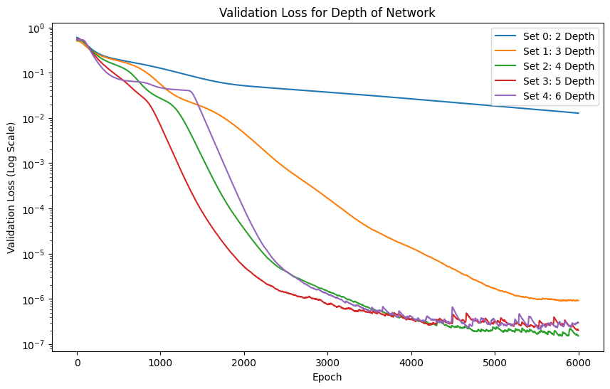
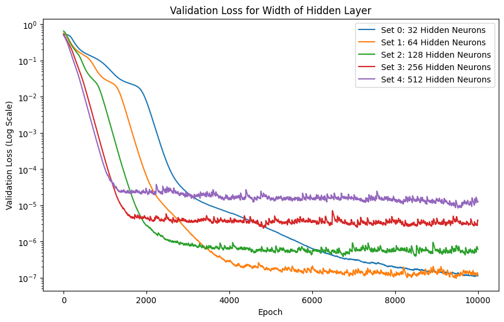
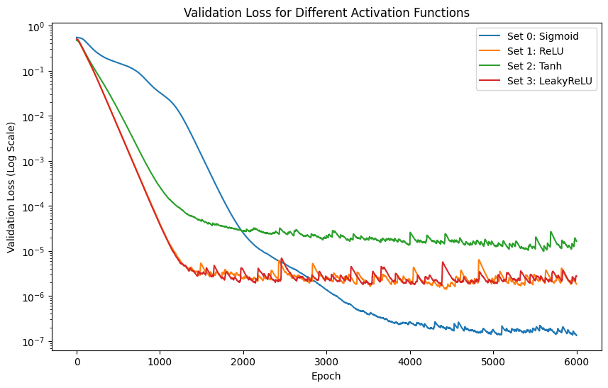
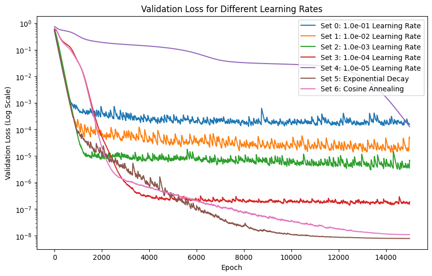
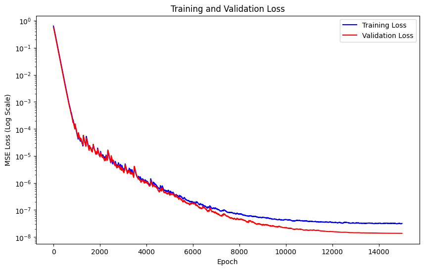
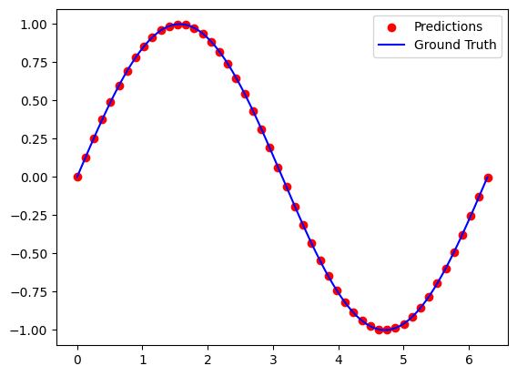

# Lab1: Feedforward Neural Network

## 1. Overview

使用 `pytorch` 或者 `tensorflow` 手写一个前馈神经网络，用于近似函数：
$$
y=\sin(x),\quad x\in[0,2\pi)
$$
并研究网络深度、学习率、网络宽度、激活函数对模型性能的影响。

## 2. Experiment

### 2.1 Datasets

根据实验要求，对 $y=\sin(x)$ 进行随机采样，生成三个互不相交的数据集分别作为训练集、验证 集、测试集。训练只在训练集上完成，实验调参只能在验证集上完成。

```python
def createDataset(num=1024):
    # create a dataset
    X = np.random.uniform(0, 2 * np.pi, num)
    Y = np.sin(X) + np.random.normal(0, 0, num)
    X = torch.tensor(X, dtype=torch.float32).unsqueeze(1).to(device)
    Y = torch.tensor(Y, dtype=torch.float32).unsqueeze(1).to(device)

    # shuffle the dataset 
    indices = torch.randperm(num)
    X = X[indices]
    Y = Y[indices]
num = 1024
X, Y = createDataset(num)
X_train, X_test = torch.split(X, [int(0.8 * num), num - int(0.8 * num)])
Y_train, Y_test = torch.split(Y, [int(0.8 * num), num - int(0.8 * num)])
```

### 2.2 Neural Network Model

采用 `pytorch` 搭建一个前馈神经网络，并调节网络超参数。

```python

class MLP(nn.Module):
    def __init__(self, input_dim, hidden_dim, output_dim, 
                num_layers=2, activation=nn.Sigmoid()):
        super(MLP, self).__init__()
        self.layers = nn.ModuleList()
        if num_layers < 2:
            raise ValueError("Number of layers must be greater than 1")
        for i in range(num_layers):
            if i == 0:
                self.layers.append(nn.Linear(input_dim, hidden_dim))
            elif i == num_layers - 1:
                self.layers.append(nn.Linear(hidden_dim, output_dim))
            else:
                self.layers.append(nn.Linear(hidden_dim, hidden_dim)) 
        self.activation = activation
    
    def forward(self, x):
        for layer in self.layers[:-1]:
            x = self.activation(layer(x))
        x = self.layers[-1](x)
        return x
```

### 2.3 Training

将生成的训练集输入搭建好的模型进行前向的loss 计算和反向的梯度传播，从而训练模型。

```python
def train(X, Y, hyper_param):
    num_data = X.shape[0]
    X_train, X_val = torch.split(X, [int(0.9 * num_data), num_data - int(0.9 * num_data)], dim=0)
    Y_train, Y_val = torch.split(Y, [int(0.9 * num_data), num_data - int(0.9 * num_data)], dim=0)
    # unpack hyper parameters
    num_epochs = hyper_param["num_epochs"]
    lr = hyper_param["lr"]
    batch_size = hyper_param["batch_size"]
    
    model = MLP(hyper_param['input_size'], hyper_param['hidden_size'], 
                hyper_param['output_size'],hyper_param['num_layers'],
                hyper_param['activation']).to(device)
    
    # Loss and optimizer
    criterion = nn.MSELoss()
    optimizer = torch.optim.Adam(model.parameters(), lr=hyper_param['lr'])

    # create a dataloader
    dataset = torch.utils.data.TensorDataset(X_train, Y_train)
    dataloader = torch.utils.data.DataLoader(dataset, batch_size=batch_size, shuffle=True)

    # create an optimizer
    criterion = nn.MSELoss()
    optimizer = torch.optim.Adam(model.parameters(), lr=lr)

    # create scheduler
     # Learning rate scheduler
    if "gamma" in hyper_param:
        scheduler = torch.optim.lr_scheduler.ExponentialLR(optimizer, gamma=hyper_param['gamma'])
    else:
        scheduler = None

    # train the model
    train_losses = []
    val_losses = []
    for epoch in progress_bar:
        model.train()  # Set model to training mode

        # Training loop
        for X_batch, Y_batch in dataloader:
            # Forward pass
            outputs = model(X_batch)
            loss = criterion(outputs, Y_batch)
            
            # Backward and optimize
            optimizer.zero_grad()
            loss.backward()
            optimizer.step()
        
        # Record the last batch's training loss
        train_losses.append(loss.item())
        
        # Validation step after each epoch
        with torch.no_grad():
            val_outputs = model(X_val)
            val_loss = criterion(val_outputs, Y_val)
            val_losses.append(val_loss.item())
        
        # Update learning rate scheduler
        if scheduler:
            scheduler.step()
    return train_losses, val_losses, model
```

## 3. Results

**实验环境**：Windows11，pytorch 2.4.1，CUDA 12.3

**实验数据**：采样随机采样 $y=\sin(x)$ 函数在 $[0,2\pi)$ 范围内 1024个数据点，并分成训练集、验证集、测试集训练

### 3.1 Depth

对比MLP的层数（深度）对训练性能的影响。



随着网络深度增加，类似于增加了复合函数嵌套数目，从一般趋势来看，对非线性目标函数拟合效果会更好，网络收敛的速度加快。

但是网络层数过多不一定会带来较好的结果，可能会造成梯度爆炸和梯度消失的现象，导致结果过拟合，收敛不及预期。

网络收敛速度和效果，**选择深度**为：4

### 3.2 Width

对比每层网络的神经元数目（宽度）对训练性能影响



随着网络宽度增加，网络的参数也更多，类似于增加了每层网络拟合的基函数数目，但是在网络深度不变的情况下，只增加网络宽度，网络收敛速度会变快，但也更容易造成过拟合现象。

**选择网络宽度为**：64

### 3.3 Activation

对比不同激活函数的影响



从结果来看，使用 `Sigmoid` 激活函数效果更好，可能的原因在于 $\sin$ 函数是连续的，且定义域和值域有限，规避了 `Sigmoid` 函数梯度消失的问题，同时 `Sigmoid` 也是中心对称函数，也符合目标函数分布。

**选择激活函数**：`Sigmoid`

### 3.4 Learning Rate

对比不同的学习率和学习率衰减方式：



实验中，分别对比了固定学习率下逐渐减少学习率的情况，和在训练时逐渐衰减学习率的方法。

从固定学习率的效果来看，学习率越小，往往收敛结果越好，但是过小的学习率不利于网络训练收敛。

在训练时，选择逐渐衰减学习率的方法，如：指数衰减和余弦退火衰减。使用这类方法能够在训练初期增快收敛速度，在训练后期提高收敛效果，找到全局最优解。

因此综合以上，选择**指数衰减**的方法：学习率从 $10^{-2}$ 逐渐衰减到 $10^{-6}$

## 4. Conclusions

通过以上实验，在如下参数和策略选择下，**训练时间在2分钟左右**，得到训练损失和验证集损失随迭代变化。

```sh
'input_size': 1, 
'hidden_size': 64, 
'output_size': 1, 
'num_layers': 4, 
'activation': Sigmoid(), 
'num_epochs': 15000, 
'lr': 0.01, 
'batch_size': 128, 
'gamma': 0.9993861657818901
```



在测试集中的数据得到：

```sh
Test MSE: 1.601e-08
```

重新随机采样得到下图所示，可见拟合效果很好。

