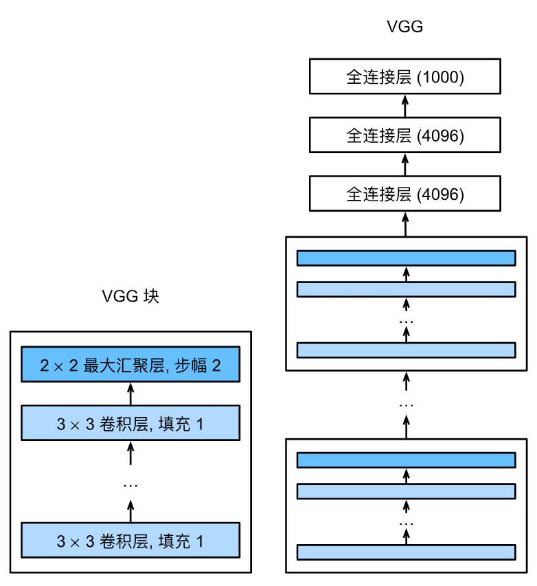
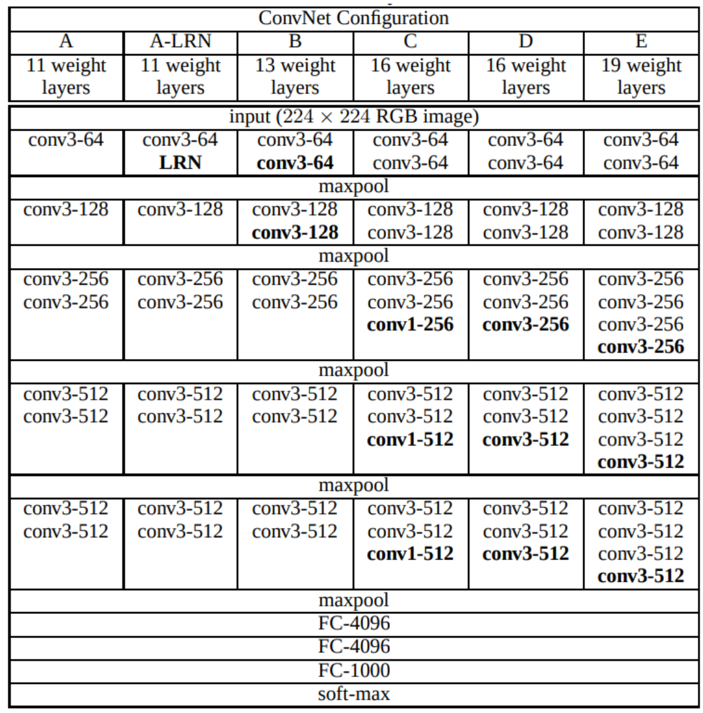
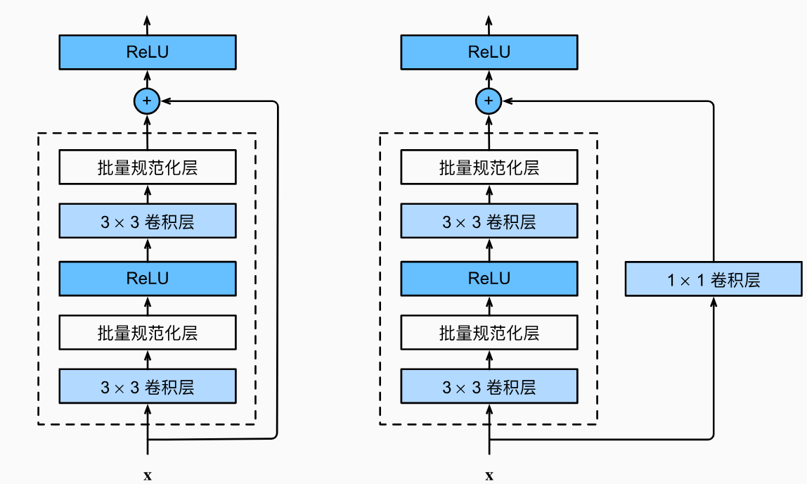

# Lab2: Convolution Neural Network

> 卷积神经网络：图像分类
>
> SA24229016 王润泽

## 1. Overview

使用 `pytorch` 实现卷积神经网络，在 ImageNet 数据集上进行图片分 类。研究 dropout, normalization, learning rate decay, residual connection, network depth等超参数对分类性能的影响。

实验测试和对比的网络架构：

- `VGG`: [Very Deep Convolutional Networks for Large-Scale Image Recognition](https://arxiv.org/abs/1409.1556)
- `ResNet`: [Deep Residual Learning for Image Recognition](https://arxiv.org/abs/1512.03385)
- `ResNeXt:` [Aggregated Residual Transformations for Deep Neural Networks](https://arxiv.org/abs/1611.05431)
- `T2T-ViT`: [Tokens-to-Token ViT: Training Vision Transformers From Scratch on ImageNet](https://openaccess.thecvf.com/content/ICCV2021/html/Yuan_Tokens-to-Token_ViT_Training_Vision_Transformers_From_Scratch_on_ImageNet_ICCV_2021_paper.html)

## 2. Experiment

### 2.0 Environment

本实验在 Linux/Windows 操作系统下进行，主要包含的库有：

- pytorch
- opencv
- numpy
- tqdm
- tensorboard

更多库见 `requirement.txt`

代码文件包含：

- `train.py` 和  `train_ddp.py`：分别用于单GPU训练和多GPU训练
- `dataset.py`：管理和加载数据
- `model/*` ：包含实验相关的网络架构 `VGG`、`ResNet` 、`ResNeXt`和 `T2T_ViT`
- `utils.py`：其他的函数

## 2.1 Dataset

实验使用 [`Tiny-Imagenet-200` ](http://cs231n.stanford.edu/tiny-imagenet-200.zip) 数据集，包含 200 个类，每个类有 500 张训练图像，50 张验证图像和 50 张测试图像。由于测试图像没有标签，因此使用数据集中的 `val` 当作测试集，并从 `train` 中手动划分新的训练集和验证集。本实验采用 `val_ratio=0.2` 比例划分数据。

### 2.1.1 Load and preprocess

在 `dataset.txt` 中按照如下方式创建数据集，值得说明的是为了避免多次处理和加载数据，采用了 **文件Cache** 的方式保存图像和标签数据，保存在 `data_path/process` 目录下。

```python
class TinyImageNetDataset(Dataset):
    def __init__(self, type_, raw_data, transform=None, force_reload=False):
        """
        type_: 'train' or 'val'
        raw_data: RawData instance
        transform: torchvision transforms to apply
        force_reload: If True, ignore cached data and reprocess
        """
        self.type = type_
        self.raw_data = raw_data
        self.force_reload = force_reload

        # Create a directory to save processed data
        self.processed_path = os.path.join(self.raw_data.data_path, "process")
        os.makedirs(self.processed_path, exist_ok=True)

        # Load or preprocess data
        if self.type == "train":
            self.images, self.labels = self._load_or_preprocess_train_data()
        else:
            self.images, self.labels = self._load_or_preprocess_val_data()

        self.transform = transforms.ToTensor() if transform is None else transform
        ......
    def __getitem__(self, index):
        label = self.labels[index]
        image = self.images[index]
        return self.transform(image), label

    def __len__(self):
        return len(self.labels)
```

### 2.1.2 Data Argument

为了高效利用图像数据，对训练数据进行相关变换操作，用于数据增强。

```python
normalize = transforms.Normalize(mean=[0.4802, 0.4481, 0.3975],
                                     std=[0.2302, 0.2265, 0.2262])
train_transform = transforms.Compose([
            transforms.ToPILImage(),
            transforms.RandomResizedCrop(64),
            transforms.RandomHorizontalFlip(),
            transforms.ToTensor(),
            normalize])
test_transform = transforms.Compose([
                           transforms.ToTensor(),
                            normalize])
```

### 2.2 Models

### 2.2.1 VGG

对于CV领域，`VGG`是最早提出使用模块 (Block) 的形式来设计网络架构，之后经典卷积神经网络的基本组成部分是下面的这个序列：

1. 带 padding 以保持分辨率的卷积层；
2. 非线性激活函数，如ReLU；
3. Pooling，如最大汇聚层

```python
def vgg_block(num_convs, in_channels, out_channels, use_norm=True):
    layers = []
    for _ in range(num_convs):
        layers.append(nn.Conv2d(in_channels, out_channels,
                                kernel_size=3, padding=1))
        if use_norm:
            layers.append(nn.BatchNorm2d(out_channels))
        layers.append(nn.ReLU())
        in_channels = out_channels
    layers.append(nn.MaxPool2d(kernel_size=2,stride=2))
    return nn.Sequential(*layers)
```


<center class="half">


</center>
****

**实验主要测试了：** BatchNorm 的效果，主要模型为：

- 含BatchNorm:  `VGG19`，包含 16 个卷积层和 3 个全连接层
- 不含BatchNorm：`VGG19 (W/O BN)`

其中，HyperParameter:

- Epochs: 200

- Optimizer: `Adam`
- Schedular: `CosineAnnealingLR`
- Learning Rate: 5e-4
- Batch Size: 256

> 为什么需要批量规范化层呢？让我们来回顾一下训练神经网络时出现的一些实际挑战。
>
> 首先，数据预处理的方式通常会对最终结果产生巨大影响。 回想一下我们应用多层感知机来预测房价的例子。 使用真实数据时，我们的第一步是标准化输入特征，使其平均值为0，方差为1。 直观地说，这种标准化可以很好地与我们的优化器配合使用，因为它可以将参数的量级进行统一。
>
> 第二，对于典型的多层感知机或卷积神经网络。当我们训练时，中间层中的变量（例如，多层感知机中的仿射变换输出）可能具有更广的变化范围：不论是沿着从输入到输出的层，跨同一层中的单元，或是随着时间的推移，模型参数的随着训练更新变幻莫测。 批量规范化的发明者非正式地假设，这些变量分布中的这种偏移可能会阻碍网络的收敛。 直观地说，我们可能会猜想，如果一个层的可变值是另一层的100倍，这可能需要对学习率进行补偿调整。
>
> 第三，更深层的网络很复杂，容易过拟合。 这意味着正则化变得更加重要。
>
> 总之，在模型训练过程中，批量规范化利用小批量的均值和标准差，不断调整神经网络的中间输出，使整个神经网络各层的中间输出值更加稳定

****

### 2.2.2 ResNet

残差神经网络的主要贡献是发现了“退化现象（Degradation）”，并针对退化现象发明了 “快捷连接（Shortcut connection）”，极大的消除了深度过大的神经网络训练困难问题。神经网络的“深度”首次突破了100层、最大的神经网络甚至超过了1000层。

具体来说，随着网络的深度变得越来越深。理论上，增加网络的深度应该能够提高模型的表现，因为更深的网络能够捕捉到更多的复杂特征。然而，随着网络深度的增加，实际训练中常常遇到以下问题：

1. **梯度消失与梯度爆炸**：在深度网络中，梯度在反向传播时容易变得非常小（梯度消失）或非常大（梯度爆炸），这使得模型难以训练。
2. **退化问题**：随着层数的增加，理论上模型的性能应该逐渐提升，但实际上，实验中发现随着网络层数的增加，训练误差反而增大，这称为退化问题（Degradation Problem）。

ResNet 的核心创新是引入了**残差块**（Residual Block），通过引入跳跃连接（Skip Connections）来解决深层网络训练中的问题。具体来说，残差块通过在每一层的输入和输出之间添加恒等映射来建立连接。这使得网络能够直接学习到输入和输出之间的**残差**，而不是直接学习复杂的映射。

**残差连接的形式：**

- 在每个残差块中，输入 $x$ 会通过一系列卷积层进行处理，产生输出 $F(x)$。
- 然后，输入 $x$ 会直接与输出 $F(x$) 相加，形成 $F(x)+x$，这个新的结果会传递到下一层。
- 这样，网络的目标就变成了学习输入与输出之间的**残差**，而不是直接学习复杂的映射。

这种设计可以通过使得梯度在反向传播时更容易流动，从而缓解梯度消失和梯度爆炸问题，同时避免了退化问题。

>  对于深度神经网络，如果我们能将新添加的层训练成*恒等映射*（identity function）$f(x)=x$，新模型和原模型将同样有效。 同时，由于新模型可能得出更优的解来拟合训练数据集，因此添加层似乎更容易降低训练误差。

```python
class ResBlock(nn.Module):    
    def __init__(self, in_channels, out_channels, stride = 1):
        super().__init__()            
        self.conv1 = nn.Conv2d(in_channels, out_channels, kernel_size = 3, 
                               stride = stride, padding = 1)
        self.bn1 = nn.BatchNorm2d(out_channels)
        self.conv2 = nn.Conv2d(out_channels, out_channels, kernel_size = 3, 
                               stride = 1, padding = 1)
        self.bn2 = nn.BatchNorm2d(out_channels)
        self.relu = nn.ReLU(inplace = True)
        if in_channels != out_channels:
            self.shortcut = nn.Sequential(
            				nn.Conv2d(in_channels, out_channels, kernel_size = 1, stride = stride),
            				nn.BatchNorm2d(out_channels))
        else:
            self.shortcut = nn.Identity()       
        
    def forward(self, x):
        i = x
        
        x = self.conv1(x)
        x = self.bn1(x)       
        x = self.relu(x)
        
        x = self.bn2(self.conv2(x))  
        x += self.shortcut(i)
        x = self.relu(x)       
        return x
```



****

**实验主要从两个方面来对比测试**： 网络深度的变化和 Skip Connections

- Depth：对比经典的 `ResNet18`、`ResNet34`、`ResNet50`
- Skip Connections：删去 `ResNet50` 中的残差连接

其中，HyperParameter:

- Epochs: 100
- Optimizer: `SGD`
- Momentum: 0.9
- Schedular: `CosineAnnealingLR`
- Learning Rate: 0.2
- Batch Size: 256

### 2.2.3 ResNeXt

ResNeXt 是一种改进的卷积神经网络架构，最早由 Facebook AI Research (FAIR) 团队在 2017 年提出。它是在 ResNet 的基础上进行扩展和优化的。ResNeXt 的设计理念是基于“分组卷积”（Group Convolution）来提高网络的表现力，同时保持计算效率和模型的可扩展性。

深度卷积神经网络（如 ResNet）在图像分类、目标检测、语义分割等任务中取得了非常好的效果，但它们通常面临以下挑战：

1. **深度网络的训练**：尽管增加网络深度通常能提高性能，但也会带来训练难度，尤其是在计算资源有限的情况下。
2. **参数数量过大**：为了提高网络表现力，增加了网络的宽度和深度，但这也会导致模型参数数量和计算量的爆炸性增长。

ResNeXt 通过结合“分组卷积”和“残差连接”两种思想，提供了一个解决方案，在不显著增加计算量的情况下大幅提升了模型的表现。

