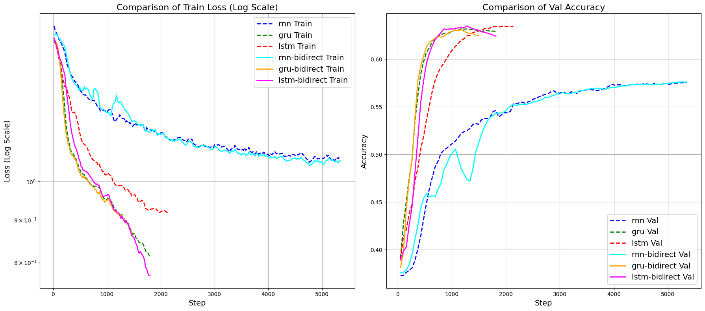

# Lab3: Recurrent Neural Networks

> 循环神经网络：文本分类

## 1. Overview

开发一个RNN语言模型，并使用训练好的词向量实现RNN模型用于文本分类。

实验测试和对比的网络架构：

- `RNN`, `Bi-RNN`
- `GRU`, `Bi-RNN`
- `LSTM`,`Bi-RNN`: Last, Mean, Max, Attention
- `Transformer`

## 2. Experiment

### 2.0 Environment

本实验在 Linux/Windows 操作系统下进行，主要包含的库有：

- pytorch
- numpy
- tqdm
- tensorboard
- transformer

### 2.1 Dataset

使用 [Yelp2013]([Yelp-Data-Challenge-2013/yelp_challenge/yelp_phoenix_academic_dataset at master · rekiksab/Yelp-Data-Challenge-2013 · GitHub](https://github.com/rekiksab/Yelp-Data-Challenge-2013/tree/master/yelp_challenge/yelp_phoenix_academic_dataset)) 数据集，将 `test.json` 用作测试集，并从 ` `中手动划分训练集和验证集。仅需使用stars评分和text评论内容。本实验采用 `val_ratio=0.05` 比例划分数据。共有约 $220,000$ 条数据。

**Note**：训练集的前1000个为 `test.json` 的内容，需要手动剔除。

数据字词长度分布如下：


选择最大文本长度为：**256，512** 都是比较合适的

#### 2.1.1 Tokenizer

为了方便建立字典表，采用了 `transformers.AutoTokenizer` 来将文本进行向量化处理，使用的是 `bert-base-uncased` 的向量化方法。

#### 2.1.2 Word Embedding

本实验对比了重头训练 **Word Embedding** ，没有使用预先训练好的 **Word Embedding** 结果。

```python
class YelpData:
    text: str
    star: int

class YelpDataset(Dataset):
    def __init__(self, data_dir, tokenizer, train=True, max_length=512):
        """
        Dataset constructor
        :param data_dir: Directory of the data files
        :param train: Whether to load training data
        :param tokenizer_name: Name of the tokenizer to use
        :param max_length: Maximum length for padding and truncation
        """
        self.is_train = train
        self.data_path = os.path.join(data_dir, 'train.json') if train else os.path.join(data_dir, 'test.json')
        self.raw_data = self._read_json(self.data_path)
        self.tokenizer = tokenizer
        self.max_length = max_length
 
    def _read_json(self, file_path):
        """
        Load training/test data from the specified directory
        :param data_dir: Directory containing the data files
        :param train: Whether to load the training data
        :return: List of data instances
        """
		...
		
    def __len__(self):
        return len(self.raw_data)
    
    def __getitem__(self, idx)
        text = self.raw_data[idx].text
        label = self.raw_data[idx].star-1
        encoding = self.tokenizer(text,
                            add_special_tokens=True,
                            truncation=True,
                            padding='max_length',
                            max_length=self.max_length,
                            return_attention_mask=True,
                            return_tensors='pt')
        return {'input_ids': encoding['input_ids'].squeeze(0),
                'attention_mask': encoding['attention_mask'].squeeze(0),
                'label': torch.tensor(label, dtype=torch.long)}
```

### 2.2 Models

#### 2.2.1 RNN

传统的RNN结构为了处理序列的文本信息，引入了隐状态 $H_t$ 的概念，用于存储前 $t$ 的时间步所学到的信息，更新方式如下：
$$
H_t=\tanh(X_tW_{xh}+H_{t-1}W_{hh}+b_h)
$$
这些变量捕获并保留了序列直到其当前时间步的历史信息， 就如当前时间步下神经网络的状态或记忆， 因此这样的隐藏变量被称为*隐状态*（hidden state）


```python

class RNNCell(nn.Module):
    def __init__(self, input_size, hidden_size):
        super().__init__()
        self.hidden_size = hidden_size
        # Combined weight for input and hidden states
        self.W = nn.Parameter(torch.Tensor(hidden_size, input_size + hidden_size))
        self.bias = nn.Parameter(torch.Tensor(hidden_size))
        self.reset_parameters()

    def reset_parameters(self):
        stdv = 1.0 / math.sqrt(self.hidden_size)
        nn.init.uniform_(self.W, -stdv, stdv)
        nn.init.uniform_(self.bias, -stdv, stdv)

    def forward(self, x, h_prev):
        # Concatenate input and previous hidden state
        combined = torch.cat((x, h_prev), dim=1)
        # Linear transformation followed by tanh activation
        h_next = torch.tanh(F.linear(combined, self.W, self.bias))
        return h_next
```

#### 2.2.2 GRU

门控循环单元（Gated Recurrent Unit, GRU）是RNN的一种改进，旨在解决传统RNN在处理长序列时的梯度消失问题。GRU通过引入重置门（reset gate）和更新门（update gate）来控制信息的流动，从而更有效地捕捉重要的序列信息。

更新方式如下：
$$
\hat{H}_t =\tanh(X_tW_{xh}+(R_t\odot H_{t-1})W_{hh}+b_h)\\
H_t=Z_t \odot H_{t-1}+(1-Z_t)\odot \hat{H}_t
$$


```python
class GRUCell(nn.Module):
    def __init__(self, input_size, hidden_size):
        super().__init__()
        self.hidden_size = hidden_size
        
        # Combine weights for update, reset, and new gates
        self.W_ih = nn.Parameter(torch.Tensor(3 * hidden_size, input_size))
        self.W_hh = nn.Parameter(torch.Tensor(3 * hidden_size, hidden_size))
        self.bias = nn.Parameter(torch.Tensor(3 * hidden_size))

    def forward(self, x, h_prev):
        # Linear transformations
        gates = F.linear(x, self.W_ih, self.bias) + F.linear(h_prev, self.W_hh)
        
        # Split into update, reset, and new gates
        z_t, r_t, n_t = gates.chunk(3, dim=1)
        
        # Apply activations
        z_t = torch.sigmoid(z_t)
        r_t = torch.sigmoid(r_t)
        n_t = torch.tanh(n_t + r_t * F.linear(h_prev, self.W_hh, self.bias))  # Adjusted for the new gate
        
        # Compute next hidden state
        h_next = (1 - z_t) * n_t + z_t * h_prev
        
        return h_next
```

#### 2.2.3 LSTM

长短期记忆网络（Long Short-Term Memory, LSTM）是另一种改进的RNN结构，旨在更有效地捕捉长距离依赖关系。LSTM通过引入记忆元（memory cell）以及输入门（input gate）、遗忘门（forget gate）和输出门（output gate）来控制信息的流动，从而解决传统RNN的梯度消失问题。

在门控循环单元GRU中，有一种机制来控制输入和遗忘（或跳过）。 类似地，在长短期记忆网络中，也有两个门用于这样的目的： 输入门$I_t$控制采用多少来自 $\hat{C}_t$ 的新数据， 而遗忘门$F_t$控制保留多少过去的记忆元 $C_{t-1}$ 的内容。 使用按元素乘法，得出：
$$
\hat{C}_t=\tanh(X_tW_{xc}+H_{t-1}W_{hc}+b_c)\\
C_t=F_t\odot C_{t-1}+I_t\odot \hat{C}_t
$$
最后，隐状态 $H_t$ 由输出门 $O_t$ 来控制：
$$
H_t=O_t\odot \tanh(C_t)
$$


```python
class LSTMCell(nn.Module):
    def __init__(self, input_size, hidden_size):
        """
        Initialize the LSTM cell.

        Args:
            input_size (int): The number of expected features in the input.
            hidden_size (int): The number of features in the hidden state.
        """
        super(LSTMCell, self).__init__()
        
        self.input_size = input_size
        self.hidden_size = hidden_size
        
        # Input-to-hidden weights for input, forget, cell, and output gates
        self.W_ih = nn.Parameter(torch.Tensor(4 * hidden_size, input_size))
        
        # Hidden-to-hidden weights for input, forget, cell, and output gates
        self.W_hh = nn.Parameter(torch.Tensor(4 * hidden_size, hidden_size))
        
        # Bias terms for input, forget, cell, and output gates
        self.b_ih = nn.Parameter(torch.Tensor(4 * hidden_size))
        self.b_hh = nn.Parameter(torch.Tensor(4 * hidden_size))

    def forward(self, x, hidden):
        """
        Forward pass for the LSTM cell.

        Args:
            x (Tensor): Input tensor at the current time step (batch_size, input_size).
            hidden (tuple): Tuple of (h_prev, c_prev), each of shape (batch_size, hidden_size).

        Returns:
            h_next (Tensor): Next hidden state (batch_size, hidden_size).
            c_next (Tensor): Next cell state (batch_size, hidden_size).
        """
        h_prev, c_prev = hidden

        # Compute all gate activations in a single matrix multiplication for efficiency
        gates = (torch.mm(x, self.W_ih.t()) + self.b_ih +
                 torch.mm(h_prev, self.W_hh.t()) + self.b_hh)
        
        # Split the gates into their respective components
        i_gate, f_gate, g_gate, o_gate = gates.chunk(4, 1)
        
        # Apply activations
        i = torch.sigmoid(i_gate)  # Input gate
        f = torch.sigmoid(f_gate)  # Forget gate
        g = torch.tanh(g_gate)     # Cell gate
        o = torch.sigmoid(o_gate)  # Output gate
        
        # Compute the next cell state
        c_next = f * c_prev + i * g
        
        # Compute the next hidden state
        h_next = o * torch.tanh(c_next)
        
        return h_next, c_next
```

#### 2.2.4 BiRNN

双向循环神经网络（Bidirectional Recurrent Neural Networks, **BiRNN***）通过在序列的两个方向上处理信息，使得输出层能够同时获得来自过去（前向）和未来（后向）的上下文信息。这种结构对于捕捉全局上下文和提高模型的表达能力具有显著优势。**BiRNN***可以基于传统RNN、GRU或LSTM实现。

其结构只需要在原有的 **RNN*** 基础上添加从未来反向传播的信息即可：


```python
        for layer in range(self.num_layers):
            # Extract forward and backward cells for the current layer
            forward_cell = self.cells[layer * self.num_directions + 0]
            backward_cell = self.cells[layer * self.num_directions + 1] if self.bidirectional else None
            
            # Initialize outputs for forward and backward directions
            forward_output = []
            backward_output = []
            
            # Forward direction
            h_forward = h_t[layer][0]
            for t in range(seq_len):
                input_t = x[:, t, :] if layer == 0 else outputs[:, t, :]
                h_forward = forward_cell(input_t, h_forward)
                forward_output.append(h_forward.unsqueeze(1))  # (batch_size, 1, hidden_size)
            
            # Backward direction
            if self.bidirectional:
                h_backward = h_t[layer][1]
                for t in reversed(range(seq_len)):
                    input_t = x[:, t, :] if layer == 0 else outputs[:, t, :]
                    h_backward = backward_cell(input_t, h_backward)
                    backward_output.insert(0, h_backward.unsqueeze(1))  # Prepend to maintain order
            
            # Concatenate forward and backward outputs
            if self.bidirectional:
                layer_output = torch.cat([torch.cat(forward_output, dim=1), 
                                          torch.cat(backward_output, dim=1)], dim=2)  # (batch_size, seq_len, hidden_size * 2)
            else:
                layer_output = torch.cat(forward_output, dim=1)  #  (batch_size, seq_len, hidden_size)
```

#### 2.2.5 Transformer

Transformer模型由Vaswani等人在2017年提出，彻底改变了自然语言处理领域。与传统的RNN不同，Transformer完全基于注意力机制（Attention Mechanism），无需序列的逐步处理，因此在并行计算和处理长距离依赖方面具有显著优势。

Transformer的核心组件包括多头自注意力机制（Multi-Head Self-Attention）、位置编码（Positional Encoding）以及前馈神经网络（Feed-Forward Neural Network）。其基本结构由编码器（Encoder）和解码器（Decoder）组成。

对于本实验的问题，我们主要关注编码器 (Encoder) 的搭建:


```python
class TransformerEncoderLayer(nn.Module):
    def __init__(self, d_model, nhead, dim_feedforward, dropout=0.1, activation='relu'):
        """
        Parameters:
            d_model: Embedding dimension
            nhead: Number of attention heads
            dim_feedforward: Hidden layer dimension of the feed-forward network
            dropout: Dropout probability
            activation: Activation function ('relu' or 'gelu')
        """
        super(TransformerEncoderLayer, self).__init__()
        self.self_attn = MultiHeadSelfAttention(d_model, nhead, dropout)
        self.feed_forward = FeedForward(d_model, dim_feedforward, dropout, activation)
        
        self.norm1 = nn.LayerNorm(d_model)
        self.norm2 = nn.LayerNorm(d_model)
        
        self.dropout1 = nn.Dropout(dropout)
        self.dropout2 = nn.Dropout(dropout)
    
    def forward(self, src, src_mask=None):
        """
        Parameters:
            src: Input, shape [batch_size, seq_len, d_model]
            src_mask: Mask tensor, shape [batch_size, seq_len]
        Returns:
            Output of the encoder layer, shape [batch_size, seq_len, d_model]
        """
        # Self-attention sublayer
        B,L,D = src.size()
        if src_mask is not None:
            src_mask = src_mask.unsqueeze(1).unsqueeze(2)  # [batch_size, 1, 1, seq_len]
            src_mask = src_mask.expand(B, 1, L, L)  # [batch_size, 1, seq_len, seq_len]
        attn_output = self.self_attn(src, src, src, src_mask)
        src = src + self.dropout1(attn_output)
        src = self.norm1(src)
        
        # Feed-forward sublayer
        ff_output = self.feed_forward(src)
        src = src + self.dropout2(ff_output)
        src = self.norm2(src)
        
        return src
```

### 2.4 Classifier

#### Pooling

在处理RNN网络隐状态输出时，由多种处理方式，主要包括：

- `Last`：取最后一个隐状态

- `Max`: 对所有的hidden states 取 max

- `Mean`：将所有的hidden states取平均

- `Attention`: 利用 Attention 机制对hidden states加权取平均

在处理 Transformer网络输出时，

- `CLS`: 在Transformer 结构中取第一个隐状态输出

#### Classification

最终，将 pooling output 输入给线性变换层（Decoder），得到分类结果。

```python
# Pooling out
pooled = self._pooling(output, mask)
# Apply dropout
pooled = self.dropout(pooled)
# Pass through the decoder
output = self.decoder(pooled)
```

## 3. Results

**Hyper Parameters:**

- **Learning Rate**: $[10^{-4},10^{-2}]$，不同的结构最优学习率不同，需要微调，具体见脚本文件
- **Batch Size**: 256,512
- **Text Max Len**: 512,256
- **Hidden Dim**: 256,512
- **Layers/Depth **: 2

**Optimizer**：

- Adma with Cosine LR

**Model:**

- **Type**: `RNN`, `GRU`, `LSTM`, `BiLSTM`, `BiRNN`, `BiGRU`, `Transformer`
- **Pooling**: `Last`, `Max`, `Mean`, `Attention`, `CLS`
- **Parameter Size**: **[8M,11M]**

**Early Stopping:** 实验根据验证集的拟合程度，选择最优 Acc 保存模型，并提前终止，避免过拟合

最终的结果如下**表1**：

| Model        | Pool   | Text Len | Bidirectional | Accuracy |
|--------------|--------|----------|-------------|----------|
| lstm         | last   | 512      | 1           | 0.661    |
| lstm         | max    | 512      | 1           | 0.660    |
| lstm         | attn   | 512      | 1           | 0.659    |
| lstm         | mean   | 512      | 1           | 0.659    |
| lstm         | mean   | 256      | 1           | 0.653    |
| lstm         | last   | 256      | 1           | 0.652    |
| lstm         | attn   | 256      | 1           | 0.652    |
| lstm         | max    | 256      | 1           | 0.649    |
| gru          | last | 256    | 1           | 0.645    |
| lstm         | last   | 256      | 0           | 0.637    |
| gru          | last   | 256      | 0           | 0.625    |
| transformer  |  cls	| 512	   | 0			 | 0.610	|
| transformer  | cls    | 256      | 0           | 0.596    |
| rnn          | last   | 256      | 0           | 0.569    |
| rnn          | last | 256    | 1           | 0.544    |

### 3.1. Different Model

首先我们对比了不同的RNN架构以及Transformer结构对分类的影响：

选择文本长度为 **256** ，在不含 **Biddirectional** 的结果如下，其中 **RNN*** 的Pooling操作都为 **Last Pooling**，Transformer为 **CLS** 


由结果可见，在中等规模数据集上，根据表1 Accuracy 指标 **LSTM** 的表现最优。

### 3.2. Biddrectional

接着对比 **BiRNN*** 的相比较原始的 **RNN*** 的提升，对比了三种不同的模型

选择文本长度为 **256** ， **RNN*** 的Pooling操作都为 **Last Pooling**。

考虑到 **BiRNN*** 的输出是 $2\times$ Hidden Dim，为了比较公平性，故设置:

- RNN*: Hidden Dim = 512
- BiRNN*: Hidden Dim = 256



从表1 Accuracy 结果来看，传统RNN 添加了双向后结果有所下降，可能是由于传统RNN对长记忆存储能力不足，且Hidden Dim 本身有所减少。相比较GRU, LSTM在添加了Biddrection后，性能都有所提升。

### 3.3 Pooling

第三个实验，主要对比了不同的Pooling操作对于 **BiLSTM** 的影响。

选择文本长度为 **256** ，在都含 **Biddirectional** 的条件下，结果如下：


由图中结果可以看到 **Last Pooling** 操作收敛效率更快，且准确值也很好，根据表1的结果选择 **Mean Pooling** 结果最优，但与 **Last Pooling ** 相比，仅提升 0.001，在实际操作中，选择 **Last Pooling** 更好。

### 3.4 Text Length

最后的为了探索RNN模型的上限，修改了文本截取长度，尽可能的保留原始文本，根据表1 Accuarcy的数据可以看到，选择文本长度 **256, 512** 比较，当保留较长文本信息后，对最终结果的准确度有较大提升


得到最佳Accuarcy 为: **0.661**


## 4. 总结

本次实验旨在开发并评估多种循环神经网络（RNN）架构在文本分类任务中的表现。通过构建传统RNN、双向RNN（Bi-RNN）、门控循环单元（GRU）、长短期记忆网络（LSTM）、以及Transformer模型，系统地比较了这些模型在Yelp2013数据集上的分类准确率。

### 实验结论：

1. **模型性能对比**：
   - 在不同的RNN架构中，中等规模的数据集上，**LSTM**表现最为优异，达到了最高的分类准确率（Accuracy）**0.661**。
   - 相较于传统RNN，**Bi-LSTM**和**Bi-GRU**通过引入双向结构，进一步提升了模型的表达能力和分类性能，尤其是在处理长文本时表现更为出色。
2. **Pooling方法的影响**：
   - 不同的Pooling策略对模型的收敛速度和最终准确率有显著影响。其中，**Last Pooling**在实际应用中表现出较快的收敛速度和较高的准确率，尽管**Mean Pooling**在某些情况下略有优势，但提升幅度有限，综合考虑后，**Last Pooling**更为实用。
3. **文本长度的选择**：
   - 增加文本的最大长度（从256增加到512）能够保留更多的上下文信息，显著提升了模型的分类准确率。这表明在处理包含丰富语义信息的长文本时，适当延长序列长度是提高模型性能的有效手段。
4. **Transformer模型的表现**：
   - 尽管Transformer在许多自然语言处理任务中表现出色，但在本次实验中，其分类准确率为**0.596**，低于RNN系列模型。这可能与模型的参数设置、训练策略或数据规模有关，未来可以进一步优化Transformer结构以提升其性能。

本实验通过系统性的比较，验证了不同RNN架构在文本分类任务中的有效性。结果表明，**LSTM**和**双向RNN**在捕捉长距离依赖和上下文信息方面具有明显优势，能够显著提升分类准确率。此外，合理选择Pooling方法和文本长度也是优化模型性能的重要因素。

尽管 Transformer 在本次实验中的表现略逊一筹，但本次实验只测试了 **Layers num = 2** 的情况，对于更深的网络架构，LSTM往往容易出现梯度爆炸/消失的情况，所以 Transformer 在并行计算和处理复杂长依赖关系上的潜力仍不可忽视，受限于计算资源和时间，未来有待进一步对比测试。
