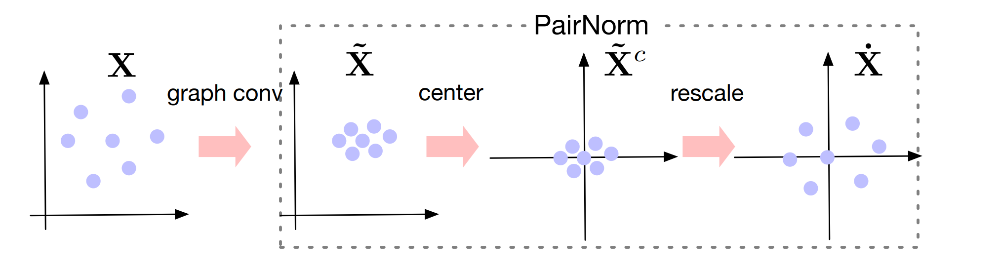

# Lab4: Graph Neural Networks

> 图神经网络：节点分类和链路预测

## 1. Overview

### 1.1 Assignment

编写图卷积神经网络模型 (GCN)，并在相应的图结构数据集上完成节点分类和链路预测任务，分析`self-loop`、`layers number`、`drop edge` 、`PairNorm` 、`activation`等因素对模型的分类和预测性能的影响 。

----

### 1.2 Frameworks

实验测试对比的网络架构：

**Network:** `GCN`

**Task**: 

- Node Classification
- Link Prediction

**Datasets:**

- Cora
- Citeseer
- PPI

**Hyper parameters**

- `Self-loop`：在GNN中添加自循环的信息传递
- `Layers Number`：GNN的层数
- `Drop edge`：训练时随机丢弃一些边
- `PairNorm` ：对每层GNN的节点特征进行归一化处理
- `activation`：`relu`、`gelu`

## 2. Graph Neural Network

### 2.1 GNN

图神经网络（Graph Neural Network, GNN）是一类专门用于处理图结构数据的神经网络模型。与传统的卷积神经网络（CNN）在网格状的数据（如图像、视频）上进行卷积运算不同，GNN需要面对图结构数据中不规则的拓扑关系——即节点之间的连接关系可能稀疏且无固定顺序。

为了解决这一问题，GNN主要基于“消息传递（**Message Passing**）”这一核心思想：节点从其邻居节点接收信息并进行聚合，从而不断更新自身表示（Embedding/ Feature）。

其迭代框架方式为 (**Massge Passing GNN**) ：
$$
\mathbf x_i^{(k)} = \gamma^{(k)}\left(\mathbf x_i^{k-1},\bigoplus_{j\in\mathcal N(i)}\phi^{(k)}(\mathbf x_i^{(k-1)},\mathbf x_j^{(k-1)},\mathbf e_{ij})\right)
$$
其中：

- $\mathbf x_i^{k}\in \mathbb R^F$ : 表示第 $k$ 层 layer 中节点 $\text{node}_i$ 输出的特征，
- $\mathcal N(i)$ : 表示和 $\text{node}_i$ 直接相连的节点，
- $\mathbf e_{ij}\in \mathbb R^D$ : 表示边的特征（optional）；
- $\bigoplus$ : 表示一种"求和"关系，可以是 `sum`, `mean`, `max`, `attention` 等；
- $\gamma,\phi$ : 表示一种可微函数，一般为线性变换 `MLP`。

### 2.2 GCN

**GCN（Graph Convolutional Network）**是GNN的经典代表，其设计旨在有效地捕捉节点及其邻居的特征信息。

GCN 通过图卷积操作将节点的特征与其邻居的特征进行聚合，从而更新节点的表示。GCN的基本思想源于卷积神经网络 (CNN) 在图像上的应用，通过局部感受野和权重共享机制来实现高效的特征提取。

在 Message Passing GNN 的框架下，我们定义 GCN 的迭代方式如下：
$$
\mathbf x_i^{(k)}=\sum_{j\in\mathcal N(i)\and \{i\}} \frac{1}{\sqrt{\text{deg}(i)}\sqrt{\text{deg}(j)}}\cdot\left(\mathbf W^T\cdot\mathbf x_j^{(k-1)}+\mathbf b\right)
$$
其中：

- $\mathbf W^T\cdot\mathbf x_j^{(k-1)}+\mathbf b$ : 表示节点经过一个 `MLP` 的线性变换结果;
- $\frac{1}{\sqrt{\text{deg}(i)}\sqrt{\text{deg}(j)}}$ : 表示了节点之间的权重关系，为度 (degree) 较少的节点给予较多的权重 ;
- $\mathcal N(i)\and \{i\}$ : 通过自连接(**Self-loop**)，节点在更新时不仅依赖邻居节点的特征，还能保留自身的原始特征信息，避免在特征传递过程中信息的丢失。

**Advantages**:

- **简单高效：** GCN通过简单的线性变换和特征聚合，能够高效地处理大规模图数据。 

- **半监督学习能力：** GCN能够在部分节点有标签的情况下，通过邻居信息传播有效地进行节点分类。

**Drawbacks**:

- **Over Smothing：** 随着图卷积层数的增加，节点的表示趋于一致，导致区分不同节点的能力下降，限制了 GCN 的深度。
- **Local Information：** 虽然多层GCN可以扩大感受野，但仍然难以捕捉全局图结构信息。

### 2.3 Over Smothing

**Over Smoothing** 是图卷积神经网络（GCN）在深层结构中面临的主要挑战之一。随着图卷积层数的增加，节点的表示逐渐趋于一致，导致不同节点之间的区分能力下降。这种现象限制了GCN模型的深度发展，并影响了其在复杂任务中的表现。

#### 2.3.1 Influence

- **特征相似性增加：** 随着层数的增加，节点的特征表示变得越来越相似，甚至趋于相同，导致模型难以区分不同类别的节点。
- **信息丢失：** 高层的节点表示可能丢失原始节点的个性化信息，影响下游任务的性能，如节点分类和链路预测。
- **训练困难：** Over Smoothing 会导致梯度消失或梯度爆炸，使得深层GCN难以训练。

为了缓解Over Smoothing问题，研究者提出了多种方法，包括PairNorm、Edge Drop 等方法。

#### 2.3.2 PairNorm

[**PairNorm**](https://arxiv.org/pdf/1909.12223) 是一种专为图神经网络设计的归一化方法，旨在缓解深层GNN中的Over Smoothing问题。它通过调整节点特征的尺度和分布，确保节点表示在训练过程中保持一定的多样性。

具体来说，PairNorm 的设计初衷是保持特征经过GNN变换后，TPSD值不变
$$
\text{TPSD}(\mathbf X) :=\sum_{i,j}||\mathbf x_i-\mathbf x_j||_2^2
$$
在算法上，只需要对 GNN 的输出进行如下处理：

```python
def PairNorm(x):
    mean = x.mean(dim=0, keepdim=True) # [1, F] 
    # Scale-Invariant PairNorm
    x = x - mean
    rownorm_individual = torch.norm(x, p=2, dim=1, keepdim=True) + 1e-8 # [N, 1]
    x = x / rownorm_individual
    return x
```



#### 2.3.3 Edge Drop 

**Edge Drop** 是一种正则化技术，通过随机删除图中的边来增加模型的鲁棒性，防止模型过度依赖局部结构，从而缓解Over Smoothing问题。

在训练过程中，随机删除一定比例的边，使得模型在不同的图结构下进行训练。在代码上可以利用 `torch_geometric` 封装的方法实现：

```python
edge_drop_index, _ = torch_geometric.utils.dropout_edge(edge_index, 
                                                   p=self.edge_dropout, 
                                                   training=self.training)
```

Edge Drop 作为一种数据增强方法，通过改变图的拓扑结构，促使模型学习更加多样化的节点表示，减少特征表示的过度平滑。能够有效防止模型在训练集上的过拟合，提高泛化能力。

## 3. Experiment

### 3.0 Environment

**OS:** Linux, Windows.

**Packages:** 

- pytorch
- torch_geometric
- transformers
- tensorboard
- dataclasses 
- lightning

### 3.1 Datasets

#### Cora 

[Core](https://linqs-data.soe.ucsc.edu/public/lbc/cora.tgz) 数据集是一个广泛使用的引文网络数据集，包含2708篇科学论文，这些论文被分为7个类别  `multiclass` 。每篇论文由一个稀疏的词袋表示，表示为一个特征向量。图中的节点代表论文，边代表引用关系。

数据特点：

- Graph：1
- Nodes: 2708
- Edges: 10556
- Average node degree: 3.90
- Node Feature: 1433
- Class：7

#### Citeseer

[Citeseer](https://linqs-data.soe.ucsc.edu/public/lbc/citeseer.tgz) 数据集是一个引文网络数据集，包含3312篇科学论文，分为6个类别   `multiclass`  。每篇论文也由一个词袋特征向量表示，节点代表论文，边代表引用关系。

数据特点：

- Graph：1
- Nodes: 3327
- Edges: 9104
- Average node degree: 2.74
- Node Feature: 3703
- Class：7

#### PPI

[PPI](http://snap.stanford.edu/graphsage/ppi.zip)（Protein-Protein Interaction）数据集来自于生物信息学领域，包含多个人类蛋白质相互作用网络。每个子图对应一个不同的细胞类型，节点代表蛋白质，边代表相互作用。节点的特征为蛋白质的生物学特征，任务为多标签节点分类   `multilabel`  。

数据特点：

- Graph: 24
- Average Nodes: 2245.30
- Average Edges: 61318.40
- Average node degree: 27.31
- Node Feature: 50
- Label: 121

---

在 `torch_geometric.datasets` 已经对相应的数据集进行封装，本实验将它们封装在 `GraphDataset` 类别中，方便处理不同任务的调用。

```python
from torch_geometric.datasets import Planetoid, PPI
class GraphDataset:
    def __init__(self, dataset_name: str, root: str = 'data', task='node-cls'):
        ...

	def _load_planetoid(self):
		# dataset_name is Cora or CiteSeer
		self.dataset = Planetoid(root=self.root, name=self.dataset_name, transform=self.transform)
		...

	def _load_ppi(self):
        # dataset_name is PPI
		self.dataset = PPI(root=self.root, transform=self.transform)
        ...
```

### 3.2 Tasks

在GNN中常见的下游应用包括节点分类和链路预测，这两类任务在各种实际场景中具有广泛的应用价值。以下将详细介绍这两种任务的定义、方法以及在GCN模型中的具体实现。 

#### 3.2.1 节点分类 (Node Classification) 

**节点分类** 是指根据节点的特征和图结构，预测每个节点所属的类别标签。这一任务在社交网络分析、引文网络、知识图谱等领域具有重要应用。例如，在引文网络中，可以根据论文的特征和引用关系预测其研究领域；在社交网络中，可以根据用户的行为和社交关系预测其兴趣类别。

在实验中，我们封装多层GNN作为上游编码模块 `GNNEnocder` ：

```python
class GNNEnocder(nn.Module):
    def __init__(self, in_channels, 
    				hidden_channels, 
    				out_channels=None, 
    				gnn_type='gcn', 
                    num_layers=2, 
                    dropout=0.5, 
                    edge_dropout = 0.0,
                    self_loop = True,
                    pairnorm_mode = None,
                    activation = 'gelu'):
		...

    def forward(self, x, edge_index):
        if self.edge_dropout > 0:
            edge_index, _ = torch_geometric.utils.dropout_edge(edge_index,
                                                               p=self.edge_dropout,
                                                               training=self.training)
        for i, conv in enumerate(self.conv_layers[:-1]):
            x = conv(x, edge_index)
            if self.pairnorms:
                x = self.pairnorms[i](x)
            x = self.activation(x)
            x = self.dropout(x)
        x = self.conv_layers[-1](x, edge_index)
        return x
```

对于节点分类问题，直接`GNNEnocder` 的输出进行分类。

在实验上，不同的数据集划分，损失函数定义不同：

**Cora, CiteSeer** 

- **Dataset Split**: 由于数据集只有1个Graph数据，所以利用 `train_mask`, `val_mask`,`test_mask` 对节点进行相应的mask选择，实现数据集划分。

  > 注意，在训练时，节点之间message passing 过程是全部节点数据特征(train/val/test)参与的。

- **Loss**: 该节点分类任务每个节点都含有唯一的类别，采用 `nn.CrossEntropyLoss()` 作为损失函数

**PPI** 

- **Dataset Split**: 数据集包含了 24 个 Graphs，所以采用 $20/2/2$ 的划分方式，以图为单位进行数据集划分。
- **Loss**: 该节点分类任务每个节点可能含有多个类别属性，采用 `nn.BCEWithLogitsLoss()` 作为损失函数

#### 2.4.2 链路预测 (Link Prediction)

**链路预测** 旨在预测图中未存在的潜在边，即根据现有的图结构和节点特征，推断节点之间是否存在连接。这一任务在推荐系统、生物信息学、社交网络等领域具有重要应用。例如，在推荐系统中，可以预测用户与商品之间的潜在兴趣关系；在生物信息学中，可以预测蛋白质之间的相互作用。、

##### RandomLinkSplit

在GNN链接预测中，我们一般将链接预测转换为一个**二分类问题**：图中存在的边我们称之为**正样本 (Positive Samples)**，不存在的边我们称之为**负样本 (Negative Samples)**。

但是，网络中存在的链接数往往都是远小于不存在的链接数的，也就是说图中的正样本数量远小于负样本数量。

为了使模型训练较为均衡，我们通常先将正样本分为训练集、验证集和测试集，然后再分别从各个数据集中采样等同数量的负样本参与训练、验证以及测试。

> 在数据集划分上，除了保证test数据不应出现在训练数据集外，还需要确保消息传递和监督样本数据不会共享训练边。

1. 在原始边数据集 $\mathcal E$ 上，按照一定比例对边进行采样 **train/val/test** 划分。
2. 对于 **test** 中所划分出的边 $\mathcal E^{test}$，选择其所有作为正样本 $\mathcal E_{pos}^{test}$ ，并采样对等数目的负样本边 $\mathcal E_{neg}^{test}$ ；对于剩下的边 $\mathcal E- \mathcal E_{pos}^{test}$ 则作为GNN的输入，用于消息传递。
3. 对于 **val** 中所划分出的边 $\mathcal E^{val}$，选择其所有作为正样本 $\mathcal E_{pos}^{val}$ ，并采样对等数目的负样本边 $\mathcal E_{neg}^{val}$ ；对于剩下的边，需要剔除 **test** 中出现的样本，即 $\mathcal E- \mathcal E_{pos}^{test}-\mathcal E_{pos}^{val}=\mathcal E^{train}$ 作为GNN的输入，用于消息传递。
4. 对于 **train** 中所划分出的边 $\mathcal E^{train}$，随机选择一半作为正样本 $\mathcal E_{pos}^{train}$，并在每轮训练时采样对等数目的负样本边 $\mathcal E_{neg}^{val}$ ，可以有效提高模型泛化能力。在训练时，采用 $\mathcal E^{train}$ 作为GNN的输入，用于消息传递。

在实际代码实现上只需要使用 `torch_geometric.transforms` 所提供的边采样划分方法即可，实验中采用 **0.85 : 0.05 : 0.1** 的边数据划分：

```python
transformer = torch_geometric.transforms.RandomLinkSplit(num_val=0.05,
														num_test=0.1, 
														add_negative_train_samples=False)
train,val,test = transformer(dataset)
```

对于 **Cora, CiteSeer, PPI** 数据集，我们对各个数据集中的每个图都采用相同的操作。

例如，对于 **Cora** 的Train Grpah：

```python
Data(x=[2708, 1433], edge_index=[2, 8448], edge_label=[4224], edge_label_index=[2, 4224]) 
```

- x: 表示节点特征
- edge_index: 表示消息传递图的节点邻接关系
- edge_label: 表示样本边的Positive/Negative 属性
- edge_label_index：表示样本边的邻接关系

##### Loss

当我们获取 `GNNEncoder` 的输出结果后，需要针对样本边的进行处理。具体来说，采用余弦相似度的形式判断节点的相似度:
$$
\text{sim}(\mathbf x_i,\mathbf x_j) = \mathbf x_i\cdot\mathbf x_j
$$
接着由 `nn.BCEWithLogitsLoss()` 计算损失函数：

```python
# x = gnn_encoder(x, edge_index)
def loss(x, edge_label_index, edge_label):
	sim = (x[edge_label_index[0]] * x[edge_label_index[1]]).sum(dim=-1)
	return nn.BCEWithLogitsLoss(sim, edge_label)
```

## 4. Results

##### Node Classification:


##### Link Prediction:

| Method                        | Citeseer   | Cora       | PPI        |
| ----------------------------- | ---------- | ---------- | ---------- |
| gcn                           | 0.7077     | 0.6973     | 0.6598     |
| gcn (W/O Self-loop)           | 0.6407     | 0.4782     | 0.6320     |
| gcn (relu)                    | 0.7011     | 0.7021     | 0.6615     |
| gcn-L4                        | 0.6912     | 0.6594     | 0.6595     |
| gcn-L4 + PairNorm             | 0.7143     | 0.7287     | 0.6804     |
| gcn-L4 + PairNorm + Edge Drop | **0.7681** | **0.7306** | **0.6882** |

