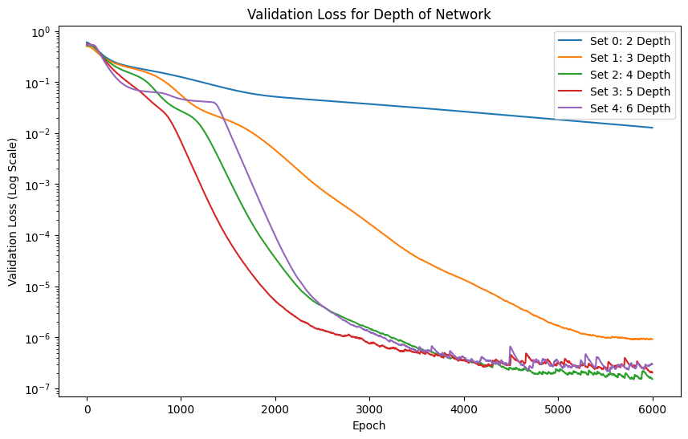
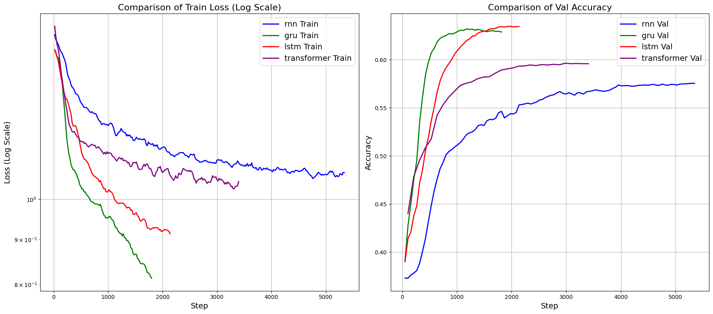
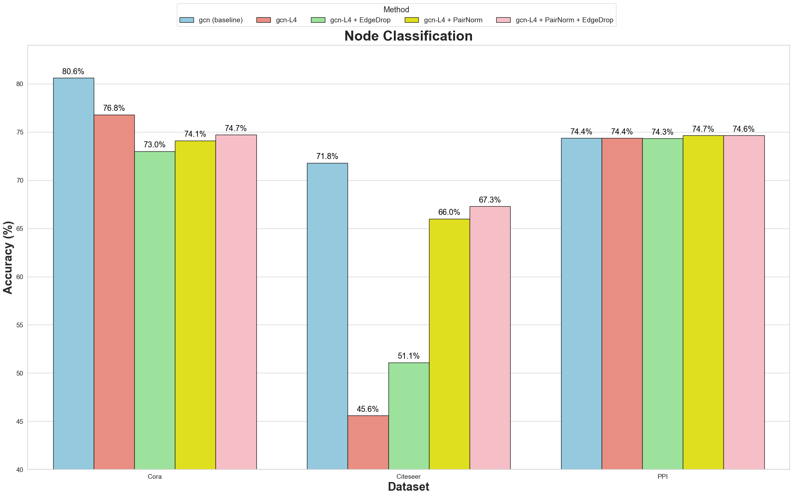
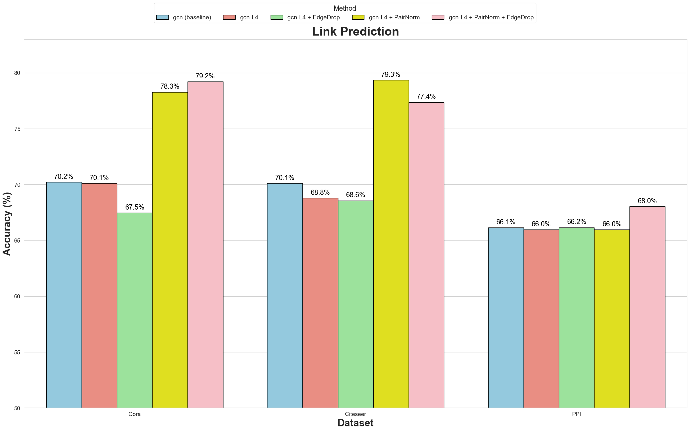

# Deep Learning

## 1. [MLP](./Lab1_MLP)

    
     
    

        MLP
    

    
 

## 2. [CNN](Lab2_CNN)

**Tiny ImageNet**

    
     
    

        CNN
    

    
 

## 3. [RNN](Lab3_RNN)

Word Embedding + RNN+ FC

| Model       | Pool | Text Len | Bidirectional | Accuracy |
| ----------- | ---- | -------- | ------------- | -------- |
| lstm        | last | 512      | 1             | 0.661    |
| lstm        | max  | 512      | 1             | 0.660    |
| lstm        | attn | 512      | 1             | 0.659    |
| lstm        | mean | 512      | 1             | 0.659    |
| lstm        | mean | 256      | 1             | 0.653    |
| lstm        | last | 256      | 1             | 0.652    |
| lstm        | attn | 256      | 1             | 0.652    |
| lstm        | max  | 256      | 1             | 0.649    |
| gru         | last | 256      | 1             | 0.645    |
| lstm        | last | 256      | 0             | 0.637    |
| gru         | last | 256      | 0             | 0.625    |
| transformer | cls  | 512      | 0             | 0.610    |
| transformer | cls  | 256      | 0             | 0.596    |
| rnn         | last | 256      | 0             | 0.569    |
| rnn         | last | 256      | 1             | 0.544    |

    
     
    

        RNN
    

    
 

## 4. [GNN](./Lab4_GNN)

##### Node Classification

    
     
    

        GNN: Node Classification
    

    
 

##### Link Prediction

    
     
    

        GNN: Link Prediction
    

    
 

